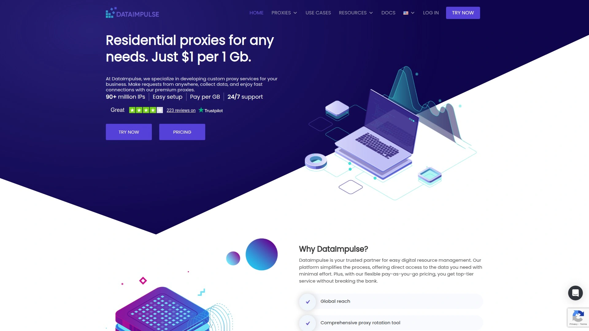

# 2025's Top 15 Best Proxy Services

Web scraping, market research, ad verification, social media management—they all hit the same wall eventually: IP blocks and access restrictions. Your requests get flagged, your scripts fail, and data extraction grinds to a halt because websites recognize and block your traffic patterns. Proxy services solve this by routing your connections through millions of real residential IPs, ISP addresses, or datacenter servers scattered globally, making your automated activities look like regular browsing from different locations. The right provider delivers the speed, anonymity, and geographic coverage your specific use case demands without burning through your budget on overpriced plans.

## **[Croxy](https://croxy.com)**

All-in-one residential and ISP proxy solution with 80+ million authentic IPs worldwide.

Croxy operates a network exceeding 80 million residential IPs sourced from real user devices, providing the geographic diversity and legitimacy that web scraping and data collection projects require. The platform supports HTTP, HTTPS, and SOCKS5 protocols across all proxy types, giving you flexibility for different applications from browser automation to API requests. Available proxy categories span residential, static residential, unlimited residential packages, datacenter, and long-acting ISP proxies—letting you match the proxy type to your specific performance and anonymity requirements.

Static residential and ISP options provide dedicated IPs that remain stable for extended periods, ideal for account management scenarios where consistent identity matters more than rotation. Meanwhile, rotating residential proxies automatically cycle through different IPs on each request or maintain sessions for configurable durations, preventing pattern detection by target sites. Global warehouse infrastructure ensures reliable connectivity with minimal downtime, addressing the frustration of proxy failures mid-task.

**Pricing structures emphasize accessibility**—competitive rates on traffic-based plans mean you're not paying enterprise premiums for small to medium projects. Customer support responds promptly with technical guidance rather than leaving you to troubleshoot connection issues alone, particularly valuable when configuring proxy settings for specific applications. For operations requiring both speed and legitimacy, Croxy's ISP proxies deliver datacenter-level performance while maintaining residential-like trust scores that don't trigger automatic blocks.

The platform particularly suits teams running social media automation, e-commerce price monitoring, or SEO rank tracking where consistent access from varied geographic locations is non-negotiable. Setup documentation walks through integration with common scraping frameworks and tools, reducing the technical barrier for developers implementing proxy rotation logic.

## **[Bright Data](https://brightdata.com)**

Industry-leading proxy network with 72+ million residential IPs and advanced targeting capabilities.

Bright Data maintains one of the largest proxy infrastructures available, featuring over 72 million residential IPs, 770,000 datacenter addresses, and 700,000 ISP proxies spanning 195 countries. The platform delivers granular targeting down to country, state, city, ASN, ZIP code, and even GPS coordinates—essential for location-specific data collection like local search results or regional pricing. Additional OS-level targeting lets you specify mobile versus desktop traffic sources, refining data accuracy for mobile-first applications.

Proxy Manager dashboard provides centralized control over multiple proxy types, automated rotation rules, and real-time performance monitoring. Web Scraper IDE offers browser-based tools for building scrapers without maintaining local infrastructure, though this adds complexity beyond simple proxy access. Unblocking capabilities handle JavaScript rendering and CAPTCHA challenges automatically, reducing manual intervention when sites employ aggressive bot detection.

**Premium positioning** means higher costs compared to budget providers—expect enterprise-level pricing that reflects the extensive feature set and massive IP pool. The platform targets businesses running large-scale operations where proxy performance and compliance matter more than per-GB cost optimization. Customer service assigns dedicated account managers for higher-tier plans, providing personalized optimization advice rather than generic support ticket responses.

Bright Data excels for organizations requiring maximum customizability, proven reliability at scale, and access to specialized tools like market intelligence datasets beyond basic proxy access. The learning curve exists—you're dealing with professional-grade infrastructure that rewards investment in proper configuration.

## **[Oxylabs](https://oxylabs.io)**

Premium proxy provider with 100+ million residential IPs and specialized scraping APIs.

Oxylabs operates a proxy network exceeding 100 million residential IPs alongside 20+ million mobile proxies and extensive datacenter coverage across 188 countries. ISP proxy offerings deliver dedicated static IPs from actual internet service providers, combining datacenter speed with residential legitimacy scores for accounts requiring persistent identities. The platform supports unlimited concurrent connections, eliminating thread restrictions that bottleneck high-volume operations.

Specialized scraping APIs include SERP Scraper for search engine data, E-Commerce Scraper for product information, and Web Scraper API for general-purpose extraction—each optimized to handle site-specific challenges without custom development. Real-time proxy pool delivers consistently high performance with minimal latency, maintaining speed even during peak usage periods. Session control allows sticky connections lasting up to 30 minutes or rotating proxies on every request depending on your use case.

**Award-winning recognition** from industry analysts like Proxyway confirms market-leading performance across reliability metrics. Pricing competes with Bright Data at the premium tier, offering comparable or superior speed and pool size at slightly lower costs. Customer support responds rapidly with technical expertise, particularly valuable when troubleshooting complex enterprise implementations.

Oxylabs suits businesses prioritizing performance and features over budget constraints, especially those scraping protected sites requiring sophisticated unblocking. The platform handles demanding scenarios like airline pricing, sneaker releases, or financial data where milliseconds and reliability determine success.

## **[Decodo](https://decodo.com)**

Best value residential proxy provider with 115 million IPs across 195+ locations.

Decodo (formerly Smartproxy) delivers exceptional value through 115 million residential IPs spanning 195 countries and all 50 US states, with targeting available down to city, state, ASN, and ZIP code levels. Pricing starts remarkably low at $1.50-3.50 per GB depending on plan size, making premium features accessible for smaller budgets. HTTP, HTTPS, and SOCKS5 (including UDP support) protocols accommodate diverse technical requirements from browser extensions to API integrations.

Rotation options span every-request cycling or sticky sessions lasting up to 24 hours, balancing anonymity with session persistence needs. Success rate consistently exceeds 99.8% with average response times under one second, delivering reliable performance without enterprise pricing. The platform includes browser extensions, anti-detect browser integration, and extensive documentation that reduces onboarding friction.

**Award-winning customer support** operates 24/7 with genuinely helpful responses rather than scripted replies, addressing technical issues quickly. Free trial lets you test performance before committing, while pay-as-you-go options eliminate subscription pressure for irregular usage patterns. API access automates proxy management tasks like retrieving new credentials or checking traffic consumption.

Decodo particularly benefits individual developers, small teams, and growing businesses seeking professional-grade proxies without massive monthly commitments. The sweet spot between features, performance, and affordability makes it repeatedly recommended by proxy comparison sites.

## **[IPRoyal](https://iproyal.com)**

Ethically-sourced proxies with flexible pay-as-you-go pricing and non-expiring traffic.

IPRoyal maintains 32+ million residential IPs across 195 countries with city-level geographic targeting and both sticky and rotating session options. Ethically-sourced IP collection ensures compliance with privacy standards, addressing concerns about how proxy networks acquire residential addresses. Non-expiring traffic means purchased data remains available indefinitely rather than resetting monthly, providing flexibility for sporadic usage.

Datacenter proxies come exclusively as dedicated IPs with unlimited bandwidth, ensuring consistent performance without sharing resources with other users. HTTP, HTTPS, and SOCKS5 protocol support covers standard requirements while dual authentication (credentials and IP whitelisting) accommodates different security preferences. Unlimited concurrent sessions remove artificial connection limits that restrict scaling.

**High-end residential pool option** provides access to premium IPs with better performance characteristics for sensitive operations. Pay-as-you-go pricing eliminates subscription commitments, letting you purchase only what you need when you need it. Intuitive dashboard simplifies proxy management with instant delivery after purchase.

IPRoyal targets cost-conscious users who still want quality proxies, particularly those with variable monthly needs that make subscriptions wasteful. Customer support availability 24/7 with dedicated account managers for larger accounts ensures assistance when issues arise.

## **[SOAX](https://soax.com)**

Stable residential and mobile proxies with advanced filtering and clean IP pools.

SOAX operates clean residential and mobile proxy pools emphasizing stability over sheer size, with flexible filtering options letting you refine targeting beyond basic geography. The platform's infrastructure focuses on maintaining reliable connections with minimal rotation failures, addressing frustrations when proxies drop mid-session. Advanced filtering includes ASN targeting, carrier selection for mobile proxies, and custom rules that match your specific requirements.

Residential proxy pool provides consistent access across global locations with session control spanning instant rotation to extended sticky sessions. Mobile proxies offer real mobile carrier IPs for scenarios specifically requiring smartphone traffic patterns, like app testing or mobile-specific content. HTTP, HTTPS, and SOCKS5 support ensures compatibility across different tools and frameworks.

**Business-oriented positioning** means pricing reflects quality over quantity—you pay more per GB than budget providers but experience fewer connection failures and blocks. The platform particularly suits operations where stability matters more than having the absolute largest IP pool. User interface balances power with usability, providing technical control without overwhelming complexity.

SOAX works well for medium to large operations running sustained scraping jobs where proxy reliability directly impacts data quality. The provider consistently appears in premium proxy comparisons alongside Bright Data and Oxylabs.

## **[NetNut](https://netnut.io)**

Direct ISP relationships providing 85+ million residential IPs with zero CAPTCHAs.

NetNut differentiates through direct relationships with internet service providers, sourcing IPs directly from ISPs rather than through intermediary networks. This approach delivers 85+ million residential IPs and 150,000+ datacenter proxies with exceptionally clean reputation scores that rarely trigger security measures. Zero CAPTCHA and IP block promises reflect the premium quality of their IP sources, eliminating common proxy frustrations.

Website Unblocker automatically handles JavaScript rendering, CAPTCHA solving, and retry logic for difficult targets, simplifying scraping implementation. SERP Scraper API specializes in search engine data extraction with location-specific result collection built-in. B2B-sourced residential proxies reduce consent-related legal risks compared to consumer device networks.

**Bulk pricing becomes attractive** at scale with enterprise plans supporting massive concurrent usage. Session control provides sticky connections or per-request rotation as needed. The platform handles large-scale scraping operations where consistent success rates matter more than experimentation.

NetNut targets serious operations willing to pay premium prices for superior reliability and legal compliance. Businesses scraping protected sites or collecting time-sensitive data benefit most from the clean IP reputation.

## **[Webshare](https://webshare.io)**

Affordable proxy solution with 30+ million residential IPs and generous free plan.

Webshare delivers over 30 million residential proxies plus 500,000+ datacenter and ISP proxies with aggressive pricing starting at $2.99 monthly. Free plan includes 10 proxies for testing, letting you evaluate performance before committing financially. Customizable proxy lists accommodate different use cases from simple rotation to complex targeting requirements.

HTTP and SOCKS5 protocol support covers standard scraping needs while global IP coverage provides reasonable geographic distribution. Platform scalability accommodates growth from individual projects to enterprise operations without requiring provider migration. Straightforward interface reduces configuration complexity compared to feature-heavy premium providers.

**Budget-friendly positioning** makes Webshare accessible for students, freelancers, and small businesses starting with web scraping. The trade-off involves fewer advanced features than premium providers, though core functionality remains solid. Performance proves adequate for most standard scraping tasks that don't require specialized unblocking.

Webshare suits cost-conscious users prioritizing value over maximum features, particularly those testing proxy viability before scaling up. The generous free tier enables genuine evaluation rather than time-limited trials that pressure quick decisions.

## **[Rayobyte](https://rayobyte.com)**

Extensive proxy pool with customization options and non-expiring traffic packages.

Rayobyte maintains a large proxy inventory across residential, datacenter (dedicated, semi-dedicated, and rotating), and ISP categories with unlimited bandwidth on datacenter plans. City-level targeting and customizable filtering enable precise geographic and network targeting. Non-expiring traffic packages let you purchase data that remains available indefinitely, ideal for irregular usage patterns.

Datacenter proxies offer three tiers—dedicated for exclusive use, semi-dedicated for limited sharing, and rotating for automatic IP cycling—matching different performance and budget requirements. SOCKS5 and HTTP/HTTPS protocol support accommodates various technical implementations. API access enables programmatic proxy management for automated workflows.

**Affordable long-term pricing** benefits sustained users rather than optimizing for trial periods. Scraper API bundles proxy management with scraping functionality for users wanting integrated solutions. Customer support provides dedicated account managers though response times can lag during peak periods.

Rayobyte works for users needing large proxy pools for geo-targeting or ad verification who prioritize volume and affordability over cutting-edge features. The platform particularly suits search engine marketing professionals running location-based campaigns.

## **[Proxyrack](https://proxyrack.com)**

Small to medium-scale scraping solution with advanced features and flexible pricing.

Proxyrack targets small to medium operations with proxy pools sized appropriately for growing businesses rather than massive enterprises. Advanced scraping features include session management, geographic targeting, and protocol flexibility without overwhelming complexity. Pricing scales reasonably as usage increases, avoiding sudden jumps that make growth expensive.

Easy-to-use dashboard reduces learning curve for teams new to proxy services, providing clear visibility into usage patterns and performance metrics. Integration documentation covers common frameworks and tools, accelerating implementation. Customer support maintains reasonable response times for troubleshooting technical issues.

**Mid-market positioning** balances features and cost, offering more capability than budget providers without premium pricing. The platform handles standard scraping scenarios effectively though might struggle with extremely difficult targets requiring specialized unblocking. Performance proves reliable for routine data collection that doesn't push technical limits.

Proxyrack suits growing businesses scaling beyond free tools but not yet requiring enterprise-grade infrastructure. Teams running moderate-volume scraping across multiple projects find the feature-to-price ratio appealing.

## **[ScraperAPI](https://scraperapi.com)**

Developer-focused scraping tool with automatic proxy rotation and CAPTCHA handling.

ScraperAPI consolidates proxy management, browser rendering, and CAPTCHA solving into a unified API, eliminating infrastructure complexity for developers. Smart routing automatically selects optimal proxies from datacenter, residential, and mobile pools spanning 50+ countries. Request throttling prevents aggressive scraping patterns that trigger bans, intelligently pacing requests based on target site behavior.

Simple API calls replace complex proxy configuration—send your target URL and receive clean HTML without managing IP rotation, session handling, or unblocking logic. JavaScript rendering executes client-side code when needed, extracting data from dynamic sites loading content after initial page load. Specialized proxy pools optimize for ecommerce, search engines, social media, and other challenging targets.

**Free tier provides** 5,000 requests monthly for testing, with paid plans scaling to millions of requests for serious operations. Developer-friendly design prioritizes ease of integration over offering every possible feature. Documentation and code examples accelerate implementation across popular programming languages.

ScraperAPI suits developers wanting to focus on data extraction logic rather than proxy infrastructure management. The abstraction layer simplifies maintenance while potentially limiting control compared to direct proxy access.

## **[Zyte](https://zyte.com)**

Enterprise web scraping platform with AI-powered data extraction and proxy management.

Zyte (formerly Scrapinghub) delivers comprehensive scraping infrastructure combining proxy management, browser automation, and AI-powered extraction capabilities. Scraper API handles proxy rotation, JavaScript rendering, and request header management through API calls without requiring Selenium or Playwright scripts. The platform emphasizes API-first design where you describe what data you need rather than how to extract it.

Proxy management features automatically route requests through appropriate IP types based on target difficulty and geographic requirements. Success rates remain high on static and semi-dynamic pages though heavy JavaScript sites may process slower than specialized browser scraping solutions. Cloud-based infrastructure eliminates server maintenance while scaling to enterprise data volumes.

**Professional-grade positioning** targets established businesses with significant scraping needs rather than individual developers or startups. Pricing reflects enterprise focus with plans sized for sustained large-scale operations. Customer support provides technical guidance for complex implementations.

Zyte benefits organizations prioritizing managed solutions over building custom infrastructure, particularly those extracting structured data from multiple sites. The platform suits teams wanting to outsource technical scraping complexity while maintaining data quality control.

## **[Nimble](https://nimbleway.com)**

Real-time web data platform combining proxies with unblocker and automation tools.

Nimble provides residential proxies integrated with unblocker technology and browser automation drivers designed specifically for web scraping. Browserless drivers automatically manage TLS fingerprints, canvas checking, JavaScript execution, and HTTP headers—technical details that advanced bot detection examines. Cloud-based infrastructure handles browser rendering without requiring local resources.

Real-time data collection emphasizes freshness over cached results, ensuring information accuracy for time-sensitive applications. Developer-friendly implementation reduces lock-in compared to enterprise-heavy providers, offering flexibility to integrate with existing workflows. Proxy pool includes residential IPs with geographic targeting for location-specific data collection.

**ISP versus residential comparison** guidance helps choose appropriate proxy types—ISP delivers faster speeds and higher reliability while residential offers better geotargeting, anonymity, and security. Documentation covers common use cases though may require more configuration than larger providers with extensive support resources. Fine-tuning benefits large-scale projects to optimize performance.

Nimble targets developers and mid-market businesses wanting sophisticated scraping capabilities without enterprise complexity or pricing. The platform suits teams comfortable with some technical configuration in exchange for flexibility and reasonable costs.

## **[DataImpulse](https://dataimpulse.com)**

Budget-friendly traffic provider with affordable pricing and reasonable performance.

DataImpulse positions as an economical residential proxy option with low per-GB costs that make large-scale scraping financially viable. The platform provides access to residential IP pools with standard targeting and rotation features at prices significantly below premium providers. Traffic-based pricing models charge only for data consumed rather than maintaining expensive subscriptions.

Trade-offs accompany the affordability—success rates and response times may fall below premium providers, and customer support might respond slower than enterprise-focused competitors. Performance proves adequate for non-critical scraping where occasional failures don't catastrophically impact operations. Geographic coverage spans major markets though city-level targeting might be less granular than premium options.

**Value positioning** attracts users maximizing data collection within tight budgets, particularly those scraping less-protected sites that don't require premium IP reputation. The platform suits testing phases, learning projects, or high-volume low-criticality data gathering where cost per gigabyte matters more than perfect reliability. Scalability allows starting small and expanding as needs grow.

DataImpulse benefits budget-conscious operations willing to accept performance trade-offs for significant cost savings. Users should test thoroughly to ensure success rates meet their requirements before committing to large-scale usage.

## **[Infatica](https://infatica.io)**

Business-oriented proxy provider with unlimited threads and compliance focus.

Infatica targets business clients with proxy infrastructure supporting unlimited concurrent connections, eliminating thread restrictions that bottleneck parallel operations. The platform emphasizes compliance and ethical IP sourcing, addressing corporate concerns about proxy network legality and user consent. Business-focused support provides dedicated assistance for enterprise implementations.

Residential proxy pool delivers standard geographic targeting and session control features expected from modern providers. Unlimited threading particularly benefits large-scale operations running thousands of simultaneous connections, like market surveillance or comprehensive site monitoring. Protocol support and integration options accommodate various technical stacks.

**Enterprise positioning** means pricing reflects business budgets rather than individual users, with plans sized for sustained commercial operations. Customer support assigns dedicated contacts familiar with your specific implementation rather than generic ticket systems. The platform prioritizes stability and compliance over experimenting with bleeding-edge features.

Infatica suits established businesses requiring reliable proxy access with proper legal compliance and business-grade support. Organizations in regulated industries or those with strict procurement requirements benefit from the professional positioning and transparent operations.

## FAQ

**Which proxy type works best for web scraping protected sites?**
Residential proxies deliver the highest success rates on protected targets since they use IPs from real devices that websites trust, while ISP proxies offer faster speeds with good legitimacy for less-aggressive sites. Datacenter proxies work fine for unprotected content but get blocked quickly on sites with serious bot detection.

**How do I avoid getting my proxies blocked during large scraping projects?**
Implement request throttling to mimic human browsing speeds, rotate IPs frequently rather than hammering sites from the same address, and use residential or ISP proxies that blend into normal traffic patterns. Services like ScraperAPI and Zyte handle this automatically through smart routing that adjusts behavior based on target site responses.

**What's the real difference between cheap and premium proxy providers?**
Premium providers like Bright Data and Oxylabs maintain cleaner IP pools with higher success rates, faster response times, and more reliable connections, while budget options deliver adequate performance with occasional failures and slower speeds. You're paying for infrastructure quality, support responsiveness, and whether you can afford downtime in your operations.

## Choose Your Proxy Infrastructure

Selecting proxy services comes down to balancing performance requirements against budget constraints and technical complexity you're willing to manage. [Croxy](https://croxy.com) delivers that balance through extensive residential and ISP coverage at competitive prices, reliable global infrastructure, and responsive support that helps you actually solve problems rather than reading generic documentation. Match your proxy type to your use case—residential for protected sites, ISP for accounts requiring persistent identity, datacenter for speed on unprotected targets—and test thoroughly before committing to large-scale operations.
